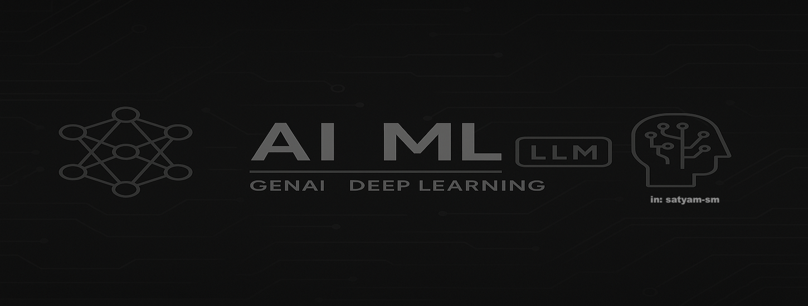

<h1 align="center">AI, ML, Deep Learning & LLMs — Content & Cookbooks</h1>

   <em>_A curated collection of hands‑on notebooks, tutorials and resources covering artificial intelligence (AI), machine learning (ML), retrieval‑augmented generation (RAG), agentic frameworks, fine‑tuning and more._

This repository is designed to help learners and practitioners explore modern AI and ML techniques. It includes annotated notebooks, markdown guides and external references to help you build intuition and hands‑on experience.
</em>

  
  

  

---

## 📌 Table of Contents  

1. **[Topic And Hands-on](#1️⃣-topic-and-hands-on)**  
2. **[Demo Applications](#2️⃣-demo-applications)**  
3. **[Interview Experiences](#3️⃣-interview-experiences)**  
4. **[External Resources](#4️⃣-external-resources)**
   - **[Free Open Source Learning Resources](#-free-open-source-learning-resources)**
   - **AI & ML Tools**
   - **Technical Blogs**
   - **Industry AI & ML Talks**
   - **Technical Newsletters**
6. **[Utils](#5️⃣-utils)** 
7. **[Repository Rules](#6️⃣-repository-rules)**  

---

## Mission and scope

This repository aims to be a comprehensive, living library of resources for AI, ML and generative AI. It covers fundamental concepts, large language models, agentic AI patterns, retrieval‑augmented generation and tooling such as LangChain, LlamaIndex etc. The focus is on **hands‑on, reproducible notebooks and guides**—each entry is intended to help you learn by doing. The repository is structured into thematic sections for ease of navigation; feel free to explore and contribute new topics.

---
## 1️⃣ Topic And Hands-on

### Agentic AI Design pattern
- [Plan & Execute Design Pattern](https://github.com/05satyam/AI-ML/blob/main/topcis_and_handson/agentic_ai_design_patterns/plan_and_execute_langgraph.ipynb)
- [Reflexion Design Pattern](https://github.com/05satyam/AI-ML/blob/main/topcis_and_handson/agentic_ai_design_patterns/reflexion_pattern.ipynb)
### Prompt Engineering & Chains
- [LangChain Prompt Chains](https://github.com/05satyam/AI-ML/blob/main/demo_applications/langchain_langgraph/lanchain-openai-prompt-chains.ipynb)
### Tokenization & Embeddings
- [Tokens in GenAI](https://github.com/05satyam/AI-ML/blob/main/topcis_and_handson/Tokens_in_AI(GenAI).ipynb)  
- [ML Word Embeddings](https://github.com/05satyam/AI-ML/blob/main/topcis_and_handson/ML_WordEmbeddings.ipynb)
### Fine-tuning & Training
- [Simple LoRA Fine-Tuning](https://github.com/05satyam/AI-ML/blob/main/topcis_and_handson/finetuning/Simple_LoRA.ipynb)
### Agentic Orchestration/Query Routing
- [LLM Query Router](https://github.com/05satyam/AI-ML/tree/main/topcis_and_handson/query_router)
### Workshop Handson
- [Agentic RAG Talk (AV + WeCloud)](https://github.com/05satyam/AI-ML/blob/main/topcis_and_handson/Talk_On_Naive_RAG_and_Agentic_RAG_and_LLM_Observability.ipynb)

## 2️⃣ Demo Applications

### Retrieval-Augmented Generation (RAG)
- [Hybrid Search RAG](https://github.com/05satyam/AI-ML/blob/main/demo_applications/simple-rag/HybridSearch.ipynb)  
- [Semantic Search w/ Pinecone](https://github.com/05satyam/AI-ML/blob/main/demo_applications/simple-rag/semantic_search_vec_pinecone.ipynb)  
- [Text-to-SQL w/ LlamaIndex](https://github.com/05satyam/AI-ML/blob/main/demo_applications/text-to-sql/Text_To_SQL_LlamaIndex.ipynb)  
### Graph-Based Applications
- [GraphMyDoc](https://github.com/05satyam/AI-ML/blob/main/demo_applications/graph_based_applications/graph_my_doc.ipynb)  
- [GraphNavAI](https://github.com/05satyam/AI-ML/blob/main/demo_applications/graph_based_applications/graph_nav.ipynb)  
- [GraphRag](https://github.com/05satyam/AI-ML/blob/main/demo_applications/graph_based_applications/graph_rag.ipynb)
### Multimodal-RAG
- [Multimodal-RAG: Text, Images](https://github.com/05satyam/AI-ML/blob/main/demo_applications/advance_rag/multimodal-rag/README.md)
### AI-Agents 
#### Langchain-Langgraph
- [LangGraph Agents](https://github.com/05satyam/AI-ML/blob/main/demo_applications/langchain_langgraph/AI_Agents_and_Agent_LangGraph.ipynb)  
#### Pydantic AI
- [PydanticAI Agents And Tools](https://github.com/05satyam/AI-ML/blob/main/demo_applications/pydnatic_ai/pydantic_ai_agents_and_tools.ipynb)
[PydanticAI Agentic Lib](https://github.com/05satyam/AI-ML/blob/main/demo_applications/pydnatic_ai/pydantic_ai_agentic_lib.ipynb)  
#### Crew AI Agents
- [Crew AI Agents](https://github.com/05satyam/AI-ML/blob/main/demo_applications/crewai/crewai_agents_basics.ipynb)  
#### Webcrawler Chatbot
- [Agentic Webcrawler Chatbot](https://github.com/05satyam/AI-ML/blob/main/demo_applications/agentic_webcrawler_chatbot.ipynb)

### Model Context Protocol (MCP)
- [MCP Server Demo](https://github.com/05satyam/AI-ML/tree/main/demo_applications/mcp_server_demo)
### LLM Observability
- [LlamaTrace - LLM Observability](https://github.com/05satyam/AI-ML/blob/main/demo_applications/llm-observability/LlamaTrace_(Hosted_Arize_Phoenix).ipynb)

## 3️⃣ Interview Expereinces

- [LLM Architecture Comparison](https://github.com/05satyam/AI-ML/blob/main/concepts-interview-experience/comparison_of_major_llms_architectures(2017-2025).md)  
- [Interview Q&A](https://github.com/05satyam/AI-ML/blob/main/concepts-interview-experience/interview-expereince/AI-ML-QnA.md)  
- [Contextual & GPT Embeddings](https://github.com/05satyam/AI-ML/blob/main/concepts-interview-experience/Contexual%20And%20GPT%20Embeddings.md)  
- [AI Agent Memory Types](https://github.com/05satyam/AI-ML/blob/main/concepts-interview-experience/ai_agents_memory_types.md)  
- [Stanford Cheatsheet on LLMs](https://github.com/05satyam/AI-ML/blob/main/concepts-interview-experience/standford_transformer_llm_cheatsheet.pdf)

## 4️⃣ External Resources

### Free Open Source Learning Resources

Free industry resources from the creators of today's most powerful GenAI and LLM tooling. These are beginner-friendly, hands-on, and backed by the actual companies building the future of AI.

| 🧠 Provider        | 📚 Free Learning Resource                                                                 | 🔍 Focus Area                                     |
|-------------------|--------------------------------------------------------------------------------------------|--------------------------------------------------|
| **LangChain**     | [Chat LangChain](https://chat.langchain.com/)                                                                       | Chat application which allows us to chat with the Langchain documentation            |
|                   | [LangChain for LLM App Dev](https://www.deeplearning.ai/short-courses/langchain-for-llm-application-development/)  | Prompting, chains, memory, evaluation            |
|                   | [Functions, Tools & Agents](https://www.deeplearning.ai/short-courses/functions-tools-agents-langchain/)             | Tool calling, agents, LCEL                       |
|                   | [LangGraph Intro Course](https://academy.langchain.com/courses/intro-to-langgraph)                                | Agentic execution with LangGraph                |
|                   | [LangChain Docs & Tutorials](https://python.langchain.com/docs/tutorials/)                                       | End-to-end LLM use cases                         |
| **LlamaIndex**    | [Chat LlamaIndex](https://chat.llamaindex.ai/)                                                                   | Chat application which allows us to chat with the LlamaIndex documentation                           |
|                   | [Advanced RAG Certification](https://learn.activeloop.ai/courses/rag)                                           | Production RAG systems                           |
|                   | [Agentic RAG Course](https://www.deeplearning.ai/short-courses/building-agentic-rag-with-llamaindex/)              | Agent-based doc query systems                    |
|                   | [LlamaIndex Docs](https://docs.llamaindex.ai/en/stable/)                                                       | Indexes, retrievers, ingestion pipelines         |
| **Hugging Face**  | [LLM Course](https://huggingface.co/learn/llm-course/chapter1/1)                                                 | Transformers, tokenizers, generation basics      |
|                   | [AI Agents Course](https://huggingface.co/learn/agents-course/unit0/introduction)                               | Agent architectures, agentic tools               |
|                   | [Diffusion Models Course](https://huggingface.co/learn/diffusion-course/unit0/1)                                 | Image generation via diffusion                   |
|                   | [Open Source Models](https://www.deeplearning.ai/short-courses/open-source-models-hugging-face/)                | Model discovery, evaluation, deployment          |
| **Microsoft**     | [Generative AI for Beginners](https://microsoft.github.io/generative-ai-for-beginners/)                         | 21-lesson hands-on course on GenAI foundations   |
|                   | [AI for Beginners](https://microsoft.github.io/AI-For-Beginners/)                                               | Classical AI, neural nets, ethics                |
|                   | [AI Agents for Beginners](https://microsoft.github.io/ai-agents-for-beginners/)                                 | Autonomy, planning, LangChain, Semantic Kernel   |
| **AWS**           | [Intro to GenAI - Art of the Possible](https://www.aboutamazon.com/news/aws/7-free-and-low-cost-aws-courses-that-can-help-you-use-generative-ai) | Real-world GenAI intro, enterprise use cases     |
|                   | [Prompt Engineering Essentials](https://www.aboutamazon.com/news/aws/7-free-and-low-cost-aws-courses-that-can-help-you-use-generative-ai) | Crafting effective prompts                       |
|                   | [Responsible AI](https://www.aboutamazon.com/news/aws/7-free-and-low-cost-aws-courses-that-can-help-you-use-generative-ai) | Fairness, bias, model accountability             |
|                   | [AWS PartyRock](https://www.aws.training/) (Search: PartyRock on AWS Educate)                                       | No-code GenAI app building                       |
| **Meta (LLaMA)**  | [Building with Llama 4](https://www.deeplearning.ai/short-courses/building-with-llama-4/)                        | Using Meta’s Llama models, long context, agents  |

---

### AI & ML Tools  
- [LLM Visualization](https://bbycroft.net/llm)  
- [Chatbot Arena LLM Leaderboard](https://lmarena.ai/)

### Tchnical Blogs  
- [DeepLearning.AI](https://www.deeplearning.ai/the-batch/)  
- [Uber AI - LLM Training](https://www.uber.com/en-GB/blog/open-source-and-in-house-how-uber-optimizes-llm-training/)  
- [Netflix ML Recommendations](https://netflixtechblog.com/)
- [Sebastian Raschka, PhD](https://magazine.sebastianraschka.com/)  

### Industry AI & ML Talks  
- [Deep Dive into LLMs - Andrej Karpathy](https://youtu.be/7xTGNNLPyMI?t=1052)  
- [Deep Dive into LLMs like ChatGPT](https://youtu.be/7xTGNNLPyMI?t=797)
- [Andrej Karpathy: Software Is Changing (Again)](https://youtu.be/LCEmiRjPEtQ)  
- [Making AI accessible with Andrej Karpathy and Stephanie Zhan](https://youtu.be/c3b-JASoPi0?t=1950)  
- [What is Agentic AI?](https://youtu.be/kJLiOGle3Lw)  
- [Discover AI - Code4AI](https://www.youtube.com/@code4AI)  
- [The AI GRID](https://www.youtube.com/@TheAiGrid)  
- [Krish Naik](https://www.youtube.com/@krishnaik06)  

### Technical Newsletters  
- [AI by Hand - Dr. Tom Yeh](https://aibyhand.substack.com/)  
- [LLM Watch - Pascal Biese](https://www.llmwatch.com/)  
- [LangChain Blogs](https://blog.langchain.dev/)  
- [Llamaindex Blogs](https://www.llamaindex.ai/blog?gad_source=1&gad_campaignid=21116317807&gbraid=0AAAAA9du_J3HOTOt0BamgikhpdzmbKhNe&gclid=Cj0KCQjw64jDBhDXARIsABkk8J6UbcJ3Nm-IgC9dGLBNqmp39kaVU65QxyJjOUZxuNHnw8Y3wVnd0U4aAjqNEALw_wcB) 
- [MLOps Architect Mindset - Ashish Patel](https://www.linkedin.com/newsletters/mlops-architect-mindset-7015185399367012352/)  
- [ByteByteGo Newsletter - Alex Xu](https://www.linkedin.com/newsletters/bytebytego-newsletter-7144012310280359936/)  

## 5️⃣ Utils

- [script_to_update_packages.py](https://github.com/05satyam/AI-ML/blob/main/script_to_update_packages.py)  
- [Steps2CreateEnvFile.MD](https://github.com/05satyam/AI-ML/blob/main/Steps2CreateEnvFile.MD)  
- [requirements.txt](https://github.com/05satyam/AI-ML/blob/main/requirements.txt)
- 
## 6️⃣ Repository Rules

- [Contributing Guide](https://github.com/05satyam/AI-ML/blob/main/repository_rules/contributing.md)  
- [Code of Conduct](https://github.com/05satyam/AI-ML/blob/main/repository_rules/code_of_conduct.md)  
- [Security Policy](https://github.com/05satyam/AI-ML/blob/main/repository_rules/SECURITY.md)  
- [MIT License](https://github.com/05satyam/AI-ML/blob/main/repository_rules/LICENSE)  
- [Citation File](https://github.com/05satyam/AI-ML/blob/main/repository_rules/CITATION.cff)

---

## Contributing and support

Contributions are welcome! If you spot an error, have an idea for a new notebook or want to help improve the documentation, please see the [contributing guidelines](repository_rules/contributing.md).

If you discover a security vulnerability, please report it privately as described in [SECURITY.md](repository_rules/SECURITY.md).  Do not open a public issue for security problems.

---

## License and citation

This project is licensed under the [MIT License](repository_rules/LICENSE).  You are free to use, modify and distribute the materials under the terms of this license.  If you build on or publish work that uses this repository, please cite it using the citation metadata in [CITATION.cff](repository_rules/CITATION.cff).

---

### Note

These notebooks and resources reflect the maintainer’s personal learnings and experiments.  While every effort has been made to ensure accuracy, mistakes are part of the journey.  Use these materials as starting points and feel free to adapt them to your own experiments.

If you find this repository helpful, please consider ⭐ starring it on GitHub.  Your support helps others discover the project and encourages further improvements.
