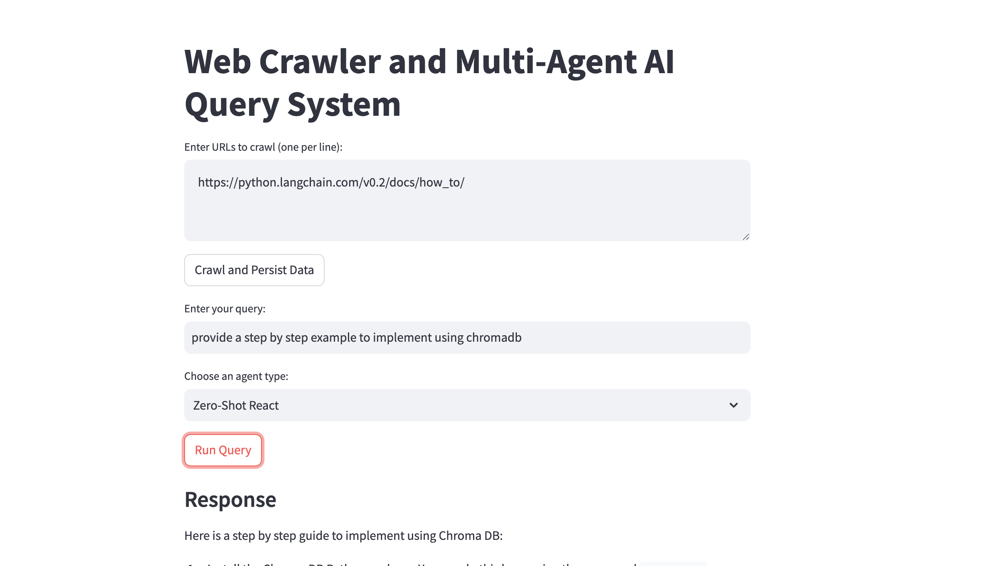
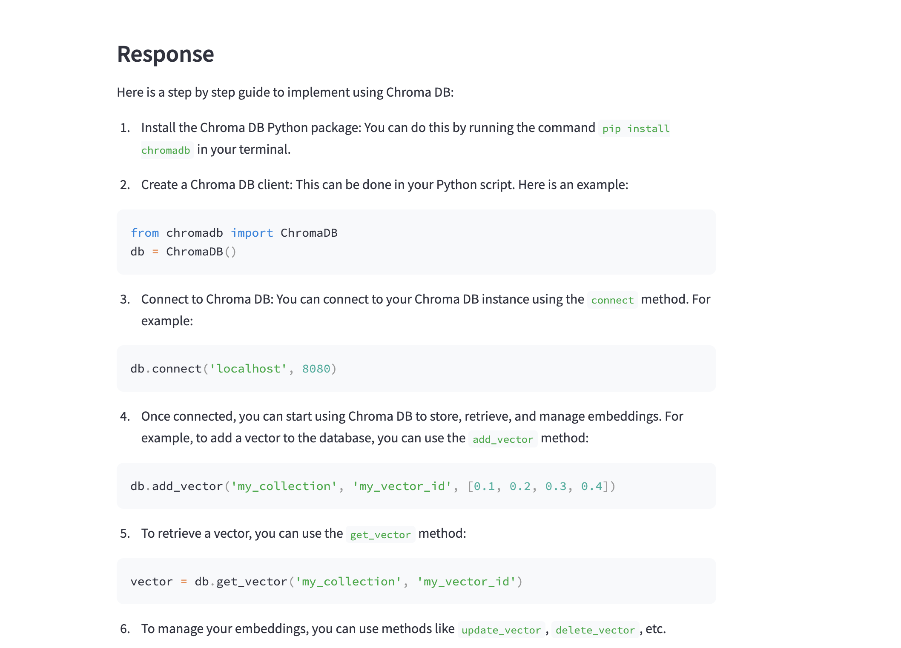

# LLMs, Quantization, Fine-Tuning, and Practice Notebooks

Welcome to this repository! This space is dedicated to exploring various aspects of large language models (LLMs), including quantization, fine-tuning, and practical implementations through notebooks. Whether you're learning about LLMs, refining models, or simply practicing with notebooks, this repository has something for you.

## Repository Contents

- **LLMs**: Explore and work with large language models, understand their architecture, and leverage them in various applications.
- **Quantization**: Learn how to reduce the size of models while maintaining performance, making them more efficient for deployment.
- **Fine-Tuning**: Dive into the fine-tuning process of pre-trained models, adapting them to specific tasks or datasets.
- **Practice Notebooks**: Hands-on practice with Jupyter notebooks related to LLMs, helping you get up to speed with real-world applications.

## Webcrawler-Agentic-System Output

As part of our exploration into AI-driven systems, we've also developed a webcrawler-agentic system. Below are screenshots of the dashboard and output from this system:

### Dashboard

### Output

These images provide a glimpse into the functionality and user interface of the webcrawler-agentic system, showcasing how we gather, store, and query information using AI agents.
