<h1 align="center">AI, ML, Deep Learning & LLMs — Content & Cookbooks</h1>

<p align="center">
  A curated, hands-on library of notebooks, demos, and resources for AI/ML, Deep Learning, Generative AI, RAG, agents, fine-tuning, and modern tooling.
</p>

<p align="center">
  <!-- <a href="https://github.com/05satyam/AI-ML" target="_blank">
    
  </a> -->
  <a href="https://www.linkedin.com/in/satyam-sm" target="_blank">
    
  </a>
</p>

<p align="center">
  
</p>

<!-- <p align="center">
  
  
  
</p> -->

---

## PyPI Library — Non-Convex Optimization Benchmark Functions

[](https://pepy.tech/projects/nonconvexoptimzationfunclib)
[](
https://clickhouse-analytics.metabaseapp.com/public/dashboard/8d516106-3a9f-4674-aafc-aa39d6380ee2?project_name=nonconvexoptimzationfunclib#&theme=night
)

A Python package providing **standard non-convex benchmark functions** for testing and benchmarking optimization algorithms.

```bash
pip install nonconvexoptimzationfunclib
```

---

## 📌 Table of Contents

1. [Mission & Scope](#-mission--scope)
2. [Pick your path](#-pick-your-path)
3. [Foundations (AI/ML Core)](#-foundations-aiml-core)
4. [LangChain (All Notebooks)](#-langchain-all-notebooks)
5. [LlamaIndex (All Notebooks)](#-llamaindex-all-notebooks)
6. [RAG Systems (All Variants)](#-rag-systems-all-variants)
7. [Agents & Orchestration](#-agents--orchestration)
8. [Graph & Multimodal](#-graph--multimodal)
9. [MCP (Model Context Protocol)](#-mcp-model-context-protocol)
10. [Observability](#-llm-observability)
11. [Interview Experiences](#-interview-experiences)
12. [External Resources](#-external-resources)
13. [Utils](#-utils)
14. [Repository Rules](#-repository-rules)
15. [Contributing & Support](#-contributing--support)
16. [License & Citation](#-license--citation)

---

## 🎯 Mission & Scope

This repository is a **living library** of practical AI/ML and Generative AI knowledge.  
The focus is on **learning by doing** — notebooks and guides are reproducible, intuitive, and easy to extend.

---


## ✨ Pick your path

If you're new, start with the path that matches your goal such as:

```mermaid
flowchart TD
  %% ========== Styles ==========
  classDef start fill:#E8F5E9,stroke:#2E7D32,stroke-width:1px,color:#1B5E20;
  classDef step  fill:#E3F2FD,stroke:#1565C0,stroke-width:1px,color:#0D47A1;
  classDef choice fill:#FFF8E1,stroke:#F57F17,stroke-width:1px,color:#E65100;
  classDef path  fill:#F3E5F5,stroke:#6A1B9A,stroke-width:1px,color:#4A148C;
  classDef build fill:#FFEBEE,stroke:#C62828,stroke-width:1px,color:#B71C1C;

  %% ========== Flow ==========
  A["🚀 Start Here<br/>Clone repo + setup venv"]:::start
  C{"Pick your learning path"}:::choice

  subgraph P["✨ Learning Paths"]
    direction TB
    F["🧠 Foundations<br/>Tokens • Embeddings • Transformers"]:::path
    H["🛠️ Hands-on Notebooks<br/>Run examples first"]:::path
    R["🔎 RAG Systems<br/>Naive → Hybrid → Graph → Multimodal"]:::path
    AG["🤖 Agents<br/>ReAct • Plan&Execute • Reflexion"]:::path
    I["🎯 Interview Prep<br/>System design + Q&A"]:::path
  end

  D["🔍 Observability & Evaluation<br/>Tracing • quality checks"]:::step
  E["🏗️ Build Mini-Projects<br/>End-to-end demo apps"]:::build
  Z["🌟 Keep iterating<br/>Add your own examples + PRs"]:::start

  %% ========== Edges ==========
  A --> C
  C --> F
  C --> H
  C --> R
  C --> AG
  C --> I

  F --> H
  H --> AG
  R --> AG
  AG --> D --> E --> Z

```


---

## Foundations (AI/ML Core)

| Notebook | What you’ll learn | Level |
|---|---|---|
| [Tokens in GenAI](https://github.com/05satyam/AI-ML/blob/main/topcis_and_handson/Tokens_in_AI(GenAI).ipynb) | Tokenization intuition + cost/latency impact | Beginner |
| [ML Word Embeddings](https://github.com/05satyam/AI-ML/blob/main/topcis_and_handson/ML_WordEmbeddings.ipynb) | Word2Vec/GloVe/CBOW intuition | Beginner |
| [Simple LoRA Fine-Tuning](https://github.com/05satyam/AI-ML/blob/main/topcis_and_handson/finetuning/Simple_LoRA.ipynb) | PEFT/LoRA fine-tuning end-to-end | All Levels |
| [Best Practices for Building AI Agents (Framework-Agnostic)](https://github.com/05satyam/AI-ML/blob/main/topcis_and_handson/agent-best-practices-framework-agnostic.md) | Best Practices |All Levels |

---

## 🔗 LangChain (All Notebooks)

Everything that uses **LangChain / LangGraph / LCEL** lives here.

| Notebook | What it does | Level | Tags |
|---|---|---|---|
| [LangChain Prompt Chains](https://github.com/05satyam/AI-ML/blob/main/demo_applications/langchain_langgraph/lanchain-openai-prompt-chains.ipynb) | Prompt chaining + LCEL patterns | All Levels | #prompting #lcel |
| [Plan & Execute (LangGraph)](https://github.com/05satyam/AI-ML/blob/main/topcis_and_handson/agentic_ai_design_patterns/plan_and_execute_langgraph.ipynb) | Multi-step planning + execution | All Levels | #langgraph #agents |
| [Reflexion Pattern](https://github.com/05satyam/AI-ML/blob/main/topcis_and_handson/agentic_ai_design_patterns/reflexion_pattern.ipynb) | Self-critique agent loops | All Levels | #agents #reasoning |
| [LangGraph Agents](https://github.com/05satyam/AI-ML/blob/main/demo_applications/langchain_langgraph/AI_Agents_and_Agent_LangGraph.ipynb) | Tool-calling agents with graphs | All Levels | #langgraph #tools |

---

## 🦙 LlamaIndex (All Notebooks)

Everything that uses **LlamaIndex** lives here.

| Notebook | What it does | Level | Tags |
|---|---|---|---|
| [Text-to-SQL w/ LlamaIndex](https://github.com/05satyam/AI-ML/blob/main/demo_applications/text-to-sql/Text_To_SQL_LlamaIndex.ipynb) | Natural language → SQL over DB | All Levels | text2sql, llamaindex |
| [LlamaExtract (LlamaIndex)](https://github.com/05satyam/AI-ML/blob/main/demo_applications/llama_index/llama_extract/llama_extract.ipynb) | Structured extraction from invoices using LlamaIndex | All Levels | llamaindex, extraction |

---

## 🔎 RAG Systems (All Variants)

All Retrieval-Augmented Generation notebooks, grouped by type.

| Notebook | RAG Type | What it does | Level |
|---|---|---|---|
| [Hybrid Search RAG](https://github.com/05satyam/AI-ML/blob/main/demo_applications/simple-rag/HybridSearch.ipynb) | Hybrid RAG | BM25 + vectors + reranking | All Levels |
| [Semantic Search (Pinecone)](https://github.com/05satyam/AI-ML/blob/main/demo_applications/simple-rag/semantic_search_vec_pinecone.ipynb) | Vector RAG | Simple embedding retrieval | All Levels |
| [GraphRAG](https://github.com/05satyam/AI-ML/blob/main/demo_applications/graph_based_applications/graph_rag.ipynb) | Graph RAG | Graph retrieval + LLM answering | Advanced |
| [Multimodal RAG: Text + Images](https://github.com/05satyam/AI-ML/blob/main/demo_applications/advance_rag/multimodal-rag/README.md) | Multimodal RAG | Retrieve across text & images | All Levels |

---

## 🤖 Agents & Orchestration

| Notebook / Resource | What it does | Level |
|---|---|---|
| [LLM Query Router](https://github.com/05satyam/AI-ML/tree/main/topcis_and_handson/query_router) | Route queries to best chain/tool | All Levels |
| [PydanticAI Agents And Tools](https://github.com/05satyam/AI-ML/blob/main/demo_applications/pydnatic_ai/pydantic_ai_agents_and_tools.ipynb) | Typed agents + strict tool schemas | All Levels |
| [PydanticAI Agentic Lib](https://github.com/05satyam/AI-ML/blob/main/demo_applications/pydnatic_ai/pydantic_ai_agentic_lib.ipynb) | Agentic patterns using PydanticAI | All Levels |
| [Crew AI Agents](https://github.com/05satyam/AI-ML/blob/main/demo_applications/crewai/crewai_agents_basics.ipynb) | Multi-agent teams + roles | All Levels |
| [Agentic Webcrawler Chatbot](https://github.com/05satyam/AI-ML/blob/main/demo_applications/agentic_webcrawler_chatbot.ipynb) | Crawl web + answer with agents | All Levels |
| [Agentic Design Patter Cookbook](https://github.com/05satyam/AI-ML/tree/main/demo_applications/agent-patterns-cookbooks/cite_rag_agent) | Agentic Design Pattern cookbook — ReAct, Plan & Execute, Self Check using Langchain | All levels|

---

## 🕸️ Graph & Multimodal

| Notebook | What it does | Level |
|---|---|---|
| [GraphMyDoc](https://github.com/05satyam/AI-ML/blob/main/demo_applications/graph_based_applications/graph_my_doc.ipynb) | Build doc knowledge graphs | All Levels |
| [GraphNavAI](https://github.com/05satyam/AI-ML/blob/main/demo_applications/graph_based_applications/graph_nav.ipynb) | Navigate knowledge as graph | All Levels |

---

## 🧩 MCP (Model Context Protocol)

| Demo | What it does | Level |
|---|---|---|
| [Hello World — MCP](https://github.com/05satyam/AI-ML/blob/main/demo_applications/mcp_handson/hello_world_of_mcp/MCP_README.md) | Hello World — MCP | All Levels |
| [MCP Server Demo](https://github.com/05satyam/AI-ML/tree/main/demo_applications/mcp_handson/mcp_server_demo) | MCP server-client tooling end-to-end | All Levels |

---

## 📈 Observability

| Notebook | What it does | Level |
|---|---|---|
| [LlamaTrace — Observability](https://github.com/05satyam/AI-ML/blob/main/demo_applications/llm-observability/LlamaTrace_(Hosted_Arize_Phoenix).ipynb) | Tracing, evals, monitoring with Phoenix | All Levels |
| [ARIZE — Observability](https://github.com/05satyam/AI-ML/blob/main/demo_applications/llm-observability/ARIZE%E2%80%94Obervability%E2%80%94Hands_on.ipynb) | AI-AGENT Tracing, evals, monitoring with ARIZE | All Levels |

---

## 🎯 Interview Experiences

| Doc | Focus Area |
|---|---|
| [LLM Architecture Comparison](https://github.com/05satyam/AI-ML/blob/main/concepts-interview-experience/comparison_of_major_llms_architectures(2017-2025).md) | Evolution of LLM architectures (2017–2025) |
| [Interview Q&A](https://github.com/05satyam/AI-ML/blob/main/concepts-interview-experience/interview-expereince/AI-ML-QnA.md) | Common AI/ML/LLM interview questions |
| [Contextual & GPT Embeddings](https://github.com/05satyam/AI-ML/blob/main/concepts-interview-experience/Contexual%20And%20GPT%20Embeddings.md) | Embedding types + intuition |
| [AI Agent Memory Types](https://github.com/05satyam/AI-ML/blob/main/concepts-interview-experience/ai_agents_memory_types.md) | Memory patterns for agents |
| [Stanford LLM Cheatsheet](https://github.com/05satyam/AI-ML/blob/main/concepts-interview-experience/standford_transformer_llm_cheatsheet.pdf) | Compact transformer/LLM summary |

---

## 📚 External Resources

### Free Open Source Learning Resources

| 🧠 Provider | 📚 Resource | 🔍 Focus Area |
|---|---|---|
| **OpenSource Book: Agentic Design Patterns** | [Agentic Design Patterns](https://docs.google.com/document/u/0/d/1rsaK53T3Lg5KoGwvf8ukOUvbELRtH-V0LnOIFDxBryE/mobilebasic) | Hands-on agentic systems |
| **LangChain** | [Chat LangChain](https://chat.langchain.com/) | Chat with LangChain docs |
|  | [LangChain for LLM App Dev](https://www.deeplearning.ai/short-courses/langchain-for-llm-application-development/) | Prompting, chains, memory |
|  | [Functions, Tools & Agents](https://www.deeplearning.ai/short-courses/functions-tools-agents-langchain/) | Tool calling, agents |
|  | [LangGraph Intro Course](https://academy.langchain.com/courses/intro-to-langgraph) | Agentic execution |
|  | [LangChain Tutorials](https://python.langchain.com/docs/tutorials/) | End-to-end apps |
| **LlamaIndex** | [Chat LlamaIndex](https://chat.llamaindex.ai/) | Chat with LlamaIndex docs |
|  | [Advanced RAG Certification](https://learn.activeloop.ai/courses/rag) | Production RAG |
|  | [Agentic RAG Course](https://www.deeplearning.ai/short-courses/building-agentic-rag-with-llamaindex/) | Agentic RAG |
|  | [LlamaIndex Docs](https://docs.llamaindex.ai/en/stable/) | Indexing & ingestion |
| **Hugging Face** | [LLM Course](https://huggingface.co/learn/llm-course/chapter1/1) | Transformers & tokenizers |
|  | [AI Agents Course](https://huggingface.co/learn/agents-course/unit0/introduction) | Agent architectures |
|  | [Diffusion Models Course](https://huggingface.co/learn/diffusion-course/unit0/1) | Image diffusion |
|  | [Open Source Models](https://www.deeplearning.ai/short-courses/open-source-models-hugging-face/) | Discovery & eval |
| **Microsoft** | [Generative AI for Beginners](https://microsoft.github.io/generative-ai-for-beginners/) | GenAI foundations |
|  | [AI for Beginners](https://microsoft.github.io/AI-For-Beginners/) | Classical AI/ML |
|  | [AI Agents for Beginners](https://microsoft.github.io/ai-agents-for-beginners/) | Agent systems |
| **AWS** | [Intro to GenAI](https://www.aboutamazon.com/news/aws/7-free-and-low-cost-aws-courses-that-can-help-you-use-generative-ai) | Enterprise GenAI |
|  | [Prompt Engineering Essentials](https://www.aboutamazon.com/news/aws/7-free-and-low-cost-aws-courses-that-can-help-you-use-generative-ai) | Prompting |
|  | [Responsible AI](https://www.aboutamazon.com/news/aws/7-free-and-low-cost-aws-courses-that-can-help-you-use-generative-ai) | Governance |
|  | [AWS PartyRock](https://www.aws.training/) | No-code GenAI apps |
| **Meta (LLaMA)** | [Building with Llama 4](https://www.deeplearning.ai/short-courses/building-with-llama-4/) | Llama models |

### AI & ML Tools
- [LLM Visualization](https://bbycroft.net/llm)
- [Chatbot Arena LLM Leaderboard](https://lmarena.ai/)

### Technical Blogs
- [DeepLearning.AI — The Batch](https://www.deeplearning.ai/the-batch/)
- [Uber AI — LLM Training](https://www.uber.com/en-GB/blog/open-source-and-in-house-how-uber-optimizes-llm-training/)
- [Netflix ML Recommendations](https://netflixtechblog.com/)
- [Sebastian Raschka](https://magazine.sebastianraschka.com/)

### Industry AI & ML Talks
- [Deep Dive into LLMs — Andrej Karpathy](https://youtu.be/7xTGNNLPyMI?t=1052)
- [Deep Dive into LLMs like ChatGPT](https://youtu.be/7xTGNNLPyMI?t=797)
- [Software Is Changing (Again)](https://youtu.be/LCEmiRjPEtQ)
- [Making AI accessible](https://youtu.be/c3b-JASoPi0?t=1950)
- [What is Agentic AI?](https://youtu.be/kJLiOGle3Lw)
- [Discover AI — Code4AI](https://www.youtube.com/@code4AI)
- [The AI GRID](https://www.youtube.com/@TheAiGrid)
- [Krish Naik](https://www.youtube.com/@krishnaik06)

### Technical Newsletters
- [AI by Hand — Dr. Tom Yeh](https://aibyhand.substack.com/)
- [LLM Watch — Pascal Biese](https://www.llmwatch.com/)
- [LangChain Blog](https://blog.langchain.dev/)
- [LlamaIndex Blog](https://www.llamaindex.ai/blog)
- [MLOps Architect Mindset](https://www.linkedin.com/newsletters/mlops-architect-mindset-7015185399367012352/)
- [ByteByteGo Newsletter](https://www.linkedin.com/newsletters/bytebytego-newsletter-7144012310280359936/)

---

## 🧰 Utils

- [script_to_update_packages.py](https://github.com/05satyam/AI-ML/blob/main/script_to_update_packages.py)
- [Steps2CreateEnvFile.MD](https://github.com/05satyam/AI-ML/blob/main/Steps2CreateEnvFile.MD)
- [requirements.txt](https://github.com/05satyam/AI-ML/blob/main/requirements.txt)

---

## 📜 Repository Rules

- [Contributing Guide](https://github.com/05satyam/AI-ML/blob/main/repository_rules/contributing.md)
- [Code of Conduct](https://github.com/05satyam/AI-ML/blob/main/repository_rules/code_of_conduct.md)
- [Security Policy](https://github.com/05satyam/AI-ML/blob/main/repository_rules/security.md)
- [MIT License](https://github.com/05satyam/AI-ML/blob/main/repository_rules/license)
- [Citation File](https://github.com/05satyam/AI-ML/blob/main/repository_rules/citation.cff)

---

## 🤝 Contributing & Support

Contributions are welcome!  
If you spot an error, want a new notebook, or have an improvement idea:
- Read the **Contributing Guide**
- Open a PR / issue with a clear description

Security issues should be reported privately (see **SECURITY.md**).

---

## 📜 License
This project is licensed under the **MIT License** — see the [LICENSE](repository_rules/license) file for details.

---

### ⭐ Final Note

These notebooks reflect personal learnings and experiments.  
Mistakes are part of the journey — use this repo as a starting point and adapt freely.

If this helps you, consider giving it a ⭐ on GitHub — it helps others find it too.
