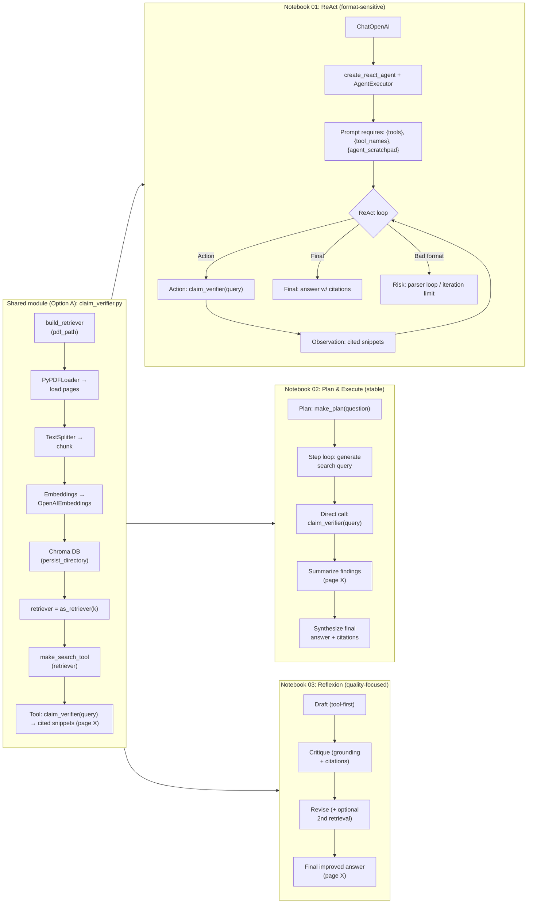

## Agent Patterns Pack (PDF Policy QA)

This mini-project demonstrates **three agent patterns** solving the **same task**:  
**answer questions from a PDF policy using retrieval + page citations**.

### What's included

- **Shared module: `claim_verifier.py`**
  - Loads a PDF, chunks it, builds a persistent **Chroma** vector index
  - Exposes one tool: `claim_verifier(query)` → returns **cited snippets with page numbers**

- **Notebook 01 — ReAct Agent**
  - Tool-using agent loop (reason → tool call → observe → answer)
  - Shows why ReAct prompts require placeholders like `{tools}`, `{tool_names}`, `{agent_scratchpad}`

- **Notebook 02 — Plan & Execute**
  - Planner creates a short step-by-step plan
  - Executor runs each step via `claim_verifier`, collects cited notes, then synthesizes the final answer

- **Notebook 03 — Reflexion / Self-check**
  - Draft answer using retrieval
  - Critique pass checks grounding + citation quality
  - Revision pass improves the final answer (optionally with a second retrieval)

### Goal

Compare **when each pattern helps** and what it costs (latency / number of model calls), while keeping answers **grounded** with **(page X)** citations.

---

