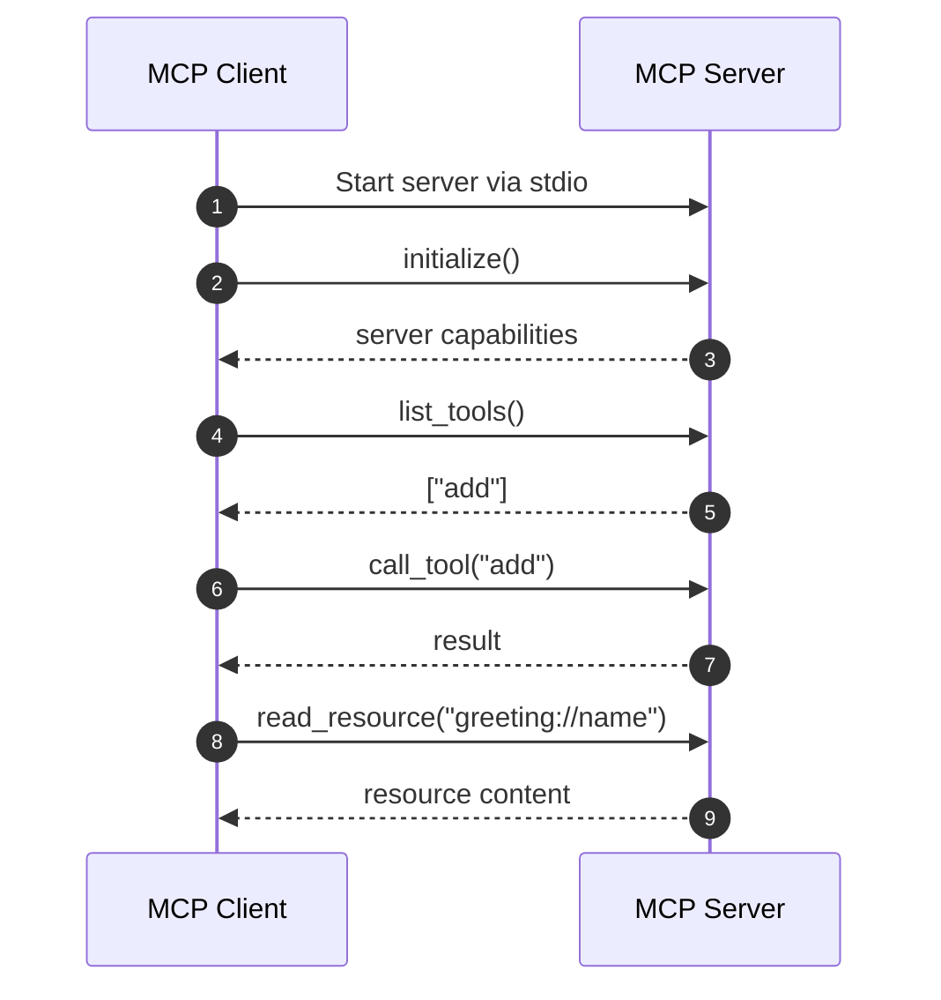

# MCP Hands-on (Python) — Tools + Resources Tutorial

A tiny, working **Model Context Protocol (MCP)** project that you can run locally to understand the core MCP concepts by *building them*, not just reading about them.

This repository is intentionally minimal and beginner-friendly. It focuses on the **core ideas of MCP** rather than advanced agent logic or complex integrations.

---

## What this tutorial covers

In this project, we demonstrate:

- ✅ An **MCP Server** that exposes:
  - a **Tool** (`add`)
  - a **Resource** (`greeting://{name}`)
- ✅ An **MCP Client** that:
  - starts the server using **stdio**
  - discovers available tools
  - calls a tool
  - reads a resource (context)

Official references:
- MCP GitHub org: https://github.com/modelcontextprotocol  
- MCP Python SDK: https://github.com/modelcontextprotocol/python-sdk  

---

## What is MCP (in plain English)?

**Model Context Protocol (MCP)** is a standard way for AI systems to interact with external capabilities such as tools and contextual data.

Instead of every AI application inventing its own way to call APIs, read files, or query knowledge bases, MCP defines a **common contract** for doing this safely and consistently.

A helpful way to think about MCP:

- **Tools** → “Do something”
  - e.g. calculate, search, fetch data, call an API
- **Resources** → “Give me context”
  - e.g. documents, configuration, user profiles, knowledge

MCP makes these capabilities:

- **Discoverable**  
  A client can ask a server what tools and resources it provides.
- **Callable**  
  Tools are invoked with structured inputs and outputs.
- **Consistent**  
  The same protocol works across many servers and integrations.

---

## Core MCP concepts used here

| Concept | Meaning |
|------|--------|
| **Client** | The AI app / agent / runtime that wants capabilities |
| **Server** | Exposes tools and resources over MCP |
| **Tool** | An action the client can invoke |
| **Resource** | Read-only contextual data, accessed via a URI |
| **Transport** | How client & server communicate |

In this tutorial we use **stdio transport**, which is the simplest setup:
- the client starts the server as a subprocess
- communication happens over standard input/output using JSON-RPC

This is commonly used for:
- local development
- desktop integrations (e.g. Claude Desktop)
- lightweight MCP demos

---

## What we built in this repo

### 1) MCP Server
The server is implemented using `FastMCP` from the official Python SDK and exposes:

- **Tool:** `add(a, b)`  
  A simple function to demonstrate how tools work.
- **Resource:** `greeting://{name}`  
  A URI-based resource that returns contextual data.

This shows both *action-style* and *context-style* capabilities.

---

### 2) MCP Client
The client connects to the server via stdio and performs the following steps:

1. Starts the MCP server process
2. Initializes an MCP session
3. Discovers available tools
4. Calls the `add` tool
5. Reads the `greeting://Ishita` resource

This simulates how an AI model or agent would interact with an MCP server.

---

## MCP workflow (high level)


pip install "mcp[cli]"
```
### Quick verification
```
python -c "from mcp.server.fastmcp import FastMCP; print('MCP installed successfully')"
```
### Run the Demo
- After starting the server:
- Run client
```
python simple_mcp_client.py
```
### Expect output as follows:
```
✅ Tools: ['add']
✅ add(3,4) = 7
✅ greeting://HELLO_WORLD = HELLO_WORLD — served via MCP resource!
```