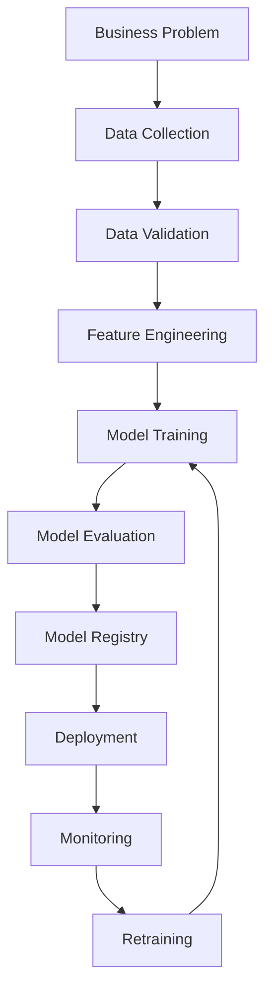

# MLOps for Beginners: From Notebook to Production

> A beginner-friendly, community-shareable guide to understanding MLOps without getting lost in buzzwords.

---

## How to Use This Guide

This is not meant to be read like a boring textbook.

Use it like a learning map:

- Start with **What is MLOps?**
- Skim the **MLOps lifecycle**
- Open the collapsible sections when you want more detail
- Use the checklists to review your understanding
- Share the roadmap with beginners who ask, “Where should I start?”

---

## Table of Contents

1. [What is MLOps?](#1-what-is-mlops)
2. [Why MLOps Matters](#2-why-mlops-matters)
3. [The MLOps Lifecycle](#3-the-mlops-lifecycle)
4. [Core Concepts You Should Know](#4-core-concepts-you-should-know)
5. [Model Deployment Patterns](#5-model-deployment-patterns)
6. [Monitoring and Retraining](#6-monitoring-and-retraining)
7. [DevOps vs MLOps](#7-devops-vs-mlops)
8. [Common Tools in MLOps](#8-common-tools-in-mlops)
9. [Beginner Roadmap](#9-beginner-roadmap)
10. [Beginner Project Ideas](#10-beginner-project-ideas)
11. [Common Mistakes](#11-common-mistakes)
12. [Final Mental Model](#12-final-mental-model)

---

# 1. What is MLOps?

**MLOps** means **Machine Learning Operations**.

It is the practice of building, deploying, monitoring, and maintaining machine learning models in a reliable way.

A machine learning model is not useful just because it works in a notebook.

It becomes useful when it can:

- run in the real world
- handle new data
- give predictions reliably
- be monitored
- be improved over time
- be rolled back safely when something goes wrong

Simple definition:

> **MLOps is DevOps for machine learning, but with extra focus on data, models, experiments, and monitoring.**

---

## Quick Analogy

Imagine you built a car engine.

That engine may work perfectly in a garage.

But to use it on the road, you also need:

- fuel system
- brakes
- dashboard
- warning lights
- maintenance plan
- safety checks
- repair process

Machine learning is similar.

The **model** is only the engine.

**MLOps is the full system that makes the model safe and useful in the real world.**

---

# 2. Why MLOps Matters

Many beginners think ML is mostly about training models.

In real projects, training is only one part.

A real ML system needs:

- clean data
- repeatable experiments
- model versioning
- automated pipelines
- deployment
- monitoring
- retraining
- rollback
- security
- documentation

Without MLOps, teams face problems like:

> “This model worked on my laptop but failed in production.”

> “We do not know which dataset was used to train this model.”

> “The model accuracy dropped, but nobody noticed.”

> “We cannot reproduce last month’s result.”

> “The model is making bad predictions on new data.”

---

## Reality Check

A model in a notebook is an experiment.

A model in production is a system.

MLOps helps you move from:

```text
Notebook experiment
```

to:

```text
Reliable production ML system
```

---

# 3. The MLOps Lifecycle

A typical ML system goes through this lifecycle:



---

# 4. Core Concepts You Should Know

This section covers the main concepts every beginner should understand.

Each concept is written in simple language.

---

<details>
<summary><strong>4.1 Business Problem Understanding</strong></summary>

Before building a model, understand the actual problem.

Bad starting question:

> “Which model should I use?”

Better starting question:

> “What business problem are we solving, and how will we measure success?”

Example:

Instead of saying:

> “Build a churn prediction model.”

Ask:

> “Can we predict which customers may leave in the next 30 days so the business team can take action?”

You should know:

- Who will use the model?
- What decision will the model support?
- What is the cost of a wrong prediction?
- How often are predictions needed?
- What metric matters to the business?

Key idea:

> Good ML starts with a clear problem, not a fancy algorithm.

</details>

---

<details>
<summary><strong>4.2 Data Collection</strong></summary>

Data is the foundation of machine learning.

Models learn patterns from data.

If the data is poor, the model will also be poor.

Common data sources:

- databases
- APIs
- CSV files
- logs
- user behavior data
- documents
- images
- sensors
- third-party data

Important questions:

- Where does the data come from?
- Is the data reliable?
- Is the data updated regularly?
- Are there missing values?
- Are there duplicates?
- Are there privacy concerns?

Key idea:

> A good model with bad data is still a bad system.

</details>

---

<details>
<summary><strong>4.3 Data Versioning</strong></summary>

In software engineering, we version code using Git.

In machine learning, we also need to version:

- datasets
- features
- model files
- training configurations
- evaluation results

Why?

Because if a model gives good results today, we should be able to reproduce it later.

Example model record:

```yaml
model_name: churn_model
model_version: v3
dataset: customer_data_2026_04
features: feature_set_v2
algorithm: xgboost
metrics:
  accuracy: 0.91
  recall: 0.87
```

Common tools:

- DVC
- LakeFS
- MLflow
- Weights & Biases
- Git LFS
- cloud storage versioning

Key idea:

> If you cannot reproduce it, you cannot fully trust it.

</details>

---

<details>
<summary><strong>4.4 Data Quality Checks</strong></summary>

Before training or prediction, check the data.

Data quality issues can silently break ML systems.

Examples:

- missing values increased suddenly
- column names changed
- data type changed
- duplicate rows appeared
- new categories appeared
- values are outside the expected range
- data is delayed

Example:

A model expects age between 0 and 100.

But suddenly the data contains:

```text
age = -5
age = 999
age = unknown
```

This can break predictions.

Common tools:

- Great Expectations
- Pandera
- TensorFlow Data Validation
- Deequ

Key idea:

> Do not trust incoming data blindly.

</details>

---

<details>
<summary><strong>4.5 Feature Engineering</strong></summary>

Features are the input signals given to the model.

Example:

For a loan approval model, features could be:

- income
- credit score
- age
- loan amount
- employment status
- repayment history

Feature engineering means creating useful input variables from raw data.

Example:

Raw data:

```text
last_login_date = 2026-05-01
today = 2026-05-06
```

Engineered feature:

```text
days_since_last_login = 5
```

Key idea:

> Good features often matter more than complex models.

</details>

---

<details>
<summary><strong>4.6 Feature Store</strong></summary>

A feature store is a central place to store and reuse features.

Why is this useful?

Because different teams may create the same features again and again.

A feature store helps with:

- feature reuse
- consistency between training and production
- feature versioning
- online and offline feature serving

Example:

The feature `customer_lifetime_value` can be used by:

- churn model
- recommendation model
- fraud model
- marketing model

Instead of rebuilding it everywhere, store it once.

Common tools:

- Feast
- Tecton
- Hopsworks
- Databricks Feature Store
- SageMaker Feature Store

Key idea:

> A feature store helps teams avoid duplicate and inconsistent feature logic.

</details>

---

<details>
<summary><strong>4.7 Model Training</strong></summary>

Model training means teaching an algorithm to learn patterns from data.

Common algorithms:

- Linear Regression
- Logistic Regression
- Decision Trees
- Random Forest
- XGBoost
- LightGBM
- Neural Networks
- Transformers

During training, data is usually split into:

```text
Training data   → used to train the model
Validation data → used to tune the model
Test data       → used to evaluate final performance
```

Important warning:

> Never judge a model only on training accuracy.

A model can memorize training data and still fail on new data.

This is called **overfitting**.

</details>

---

<details>
<summary><strong>4.8 Experiment Tracking</strong></summary>

In ML, we try many experiments.

Example:

- model A with learning rate 0.01
- model B with learning rate 0.001
- model C with different features
- model D with more data

Experiment tracking helps store:

- model type
- parameters
- dataset version
- metrics
- artifacts
- notes
- plots
- model files

Common tools:

- MLflow
- Weights & Biases
- Neptune
- Comet
- ClearML

Key idea:

> Do not depend on memory. Track every serious experiment.

</details>

---

<details>
<summary><strong>4.9 Model Evaluation</strong></summary>

Model evaluation checks how well the model performs.

## Classification

Used when the output is a category.

Examples:

```text
spam or not spam
fraud or not fraud
churn or not churn
```

Common metrics:

| Metric | Simple Meaning |
|---|---|
| Accuracy | How many predictions were correct overall |
| Precision | When the model says positive, how often it is correct |
| Recall | Out of actual positives, how many the model found |
| F1 Score | Balance between precision and recall |
| ROC-AUC | How well the model separates classes |

Example:

For fraud detection, **recall** may be more important because missing fraud is costly.

For spam detection, **precision** may matter because marking important emails as spam is bad.

## Regression

Used when the output is a number.

Examples:

```text
house price
delivery time
sales forecast
temperature
```

Common metrics:

| Metric | Simple Meaning |
|---|---|
| MAE | Average prediction error |
| MSE | Squared average error |
| RMSE | Error in original unit |
| R² | How much variation the model explains |

Key idea:

> The best metric depends on the problem.

</details>

---

<details>
<summary><strong>4.10 Model Registry</strong></summary>

A model registry is like a library of models.

It stores:

- model versions
- model status
- model metadata
- approval information
- performance metrics
- deployment stage

Example stages:

```text
Experiment
Staging
Production
Archived
```

A model registry helps answer:

- Which model is currently in production?
- Who approved it?
- What data was it trained on?
- What metrics did it achieve?
- Can we roll back to an older model?

Common tools:

- MLflow Model Registry
- SageMaker Model Registry
- Vertex AI Model Registry
- Azure ML Registry

Key idea:

> A registry gives control over which model goes where.

</details>

---

# 5. Model Deployment Patterns

Deployment means making the model available for real use.

Different use cases need different deployment styles.

---

## 5.1 Batch Prediction

In batch prediction, predictions are generated in bulk at scheduled times.

Example:

> Every night, predict which customers may churn tomorrow.

Flow:

```text
Data → Model → Predictions → Database/File
```

Good for:

- daily reports
- recommendation refreshes
- risk scoring
- demand forecasting

---

## 5.2 Real-Time Prediction

In real-time prediction, the model gives a prediction immediately when a request comes in.

Example:

> A user enters card details, and the fraud model checks the transaction instantly.

Flow:

```text
User Request → API → Model → Prediction → Response
```

Good for:

- fraud detection
- search ranking
- recommendation APIs
- chatbot routing
- dynamic pricing

Common tools:

- FastAPI
- Flask
- BentoML
- KServe
- Ray Serve
- SageMaker Endpoint
- Vertex AI Endpoint

---

## 5.3 Streaming Prediction

Streaming prediction is used when data continuously arrives.

Example:

> Sensor data from machines, clickstream data, or financial transactions.

Flow:

```text
Event Stream → Feature Processing → Model → Prediction
```

Common tools:

- Kafka
- Flink
- Spark Streaming
- Kinesis
- Pub/Sub

---

## Deployment Comparison

| Pattern | When to Use | Example |
|---|---|---|
| Batch | Predictions are needed later or on schedule | Daily churn list |
| Real-time | Prediction is needed immediately | Fraud detection |
| Streaming | Data arrives continuously | IoT sensor monitoring |

---

# 6. Monitoring and Retraining

Deployment is not the end.

After deployment, we must monitor the model.

Why?

Because real-world data changes.

A model trained on old data may become weak over time.

---

## 6.1 What Should You Monitor?

Monitor both the software system and the ML behavior.

| Area | What to Watch |
|---|---|
| System health | uptime, errors, latency |
| Data quality | missing values, schema changes, invalid values |
| Prediction behavior | prediction distribution, confidence scores |
| Model quality | accuracy, precision, recall, MAE, RMSE |
| Business impact | revenue, conversion, churn, fraud prevented |

---

## 6.2 Data Drift

Data drift means the input data has changed.

Example:

A model was trained on customers mostly from the US.

Later, many new customers come from Europe and Asia.

The input data distribution changed.

This may reduce model performance.

---

## 6.3 Concept Drift

Concept drift means the relationship between input and output has changed.

Example:

Before COVID, travel booking behavior had one pattern.

During COVID, behavior changed completely.

The old model may no longer work well.

Simple difference:

```text
Data drift    = input data changed
Concept drift = meaning or pattern changed
```

---

## 6.4 Retraining

Retraining means training the model again using new data.

Retraining can happen:

- manually
- on a schedule
- when performance drops
- when drift is detected
- when new data becomes available

Examples:

```text
Retrain every week
```

or

```text
Retrain when recall drops below 85%
```

Key idea:

> A good MLOps system makes retraining repeatable and safe.

---

## 6.5 Rollback

Sometimes a new model performs worse than the old one.

Rollback means going back to a previous stable model version.

Example:

```text
Model v5 deployed
Model v5 causes high error rate
Rollback to Model v4
```

Key idea:

> Never deploy a model without a rollback plan.

---

# 7. DevOps vs MLOps

| DevOps | MLOps |
|---|---|
| Focuses on software | Focuses on software, data, and models |
| Code changes often | Data also changes often |
| Tests are mostly deterministic | ML tests are often probabilistic |
| Output is usually fixed | Model output may change |
| Monitoring checks app health | Monitoring checks app, data, and model quality |

Simple takeaway:

> DevOps manages software systems.  
> MLOps manages software systems that also depend on changing data and models.

---

# 8. Common Tools in MLOps

You do not need to learn every tool.

Start with the concept first, then pick a tool.

| Area | Tools |
|---|---|
| Code versioning | Git, GitHub, GitLab |
| Data versioning | DVC, LakeFS |
| Experiment tracking | MLflow, Weights & Biases, Neptune |
| Orchestration | Airflow, Prefect, Dagster, Kubeflow |
| Model registry | MLflow, SageMaker, Vertex AI |
| Model serving | FastAPI, BentoML, KServe, Ray Serve |
| Monitoring | Evidently AI, WhyLabs, Arize, Fiddler |
| Containers | Docker |
| Scaling | Kubernetes |
| Cloud ML | SageMaker, Vertex AI, Azure ML |
| Feature store | Feast, Tecton, Hopsworks |

---

## Beginner Tool Stack

If you are just starting, use this simple stack:

```text
Python
Pandas
Scikit-learn
GitHub
MLflow
FastAPI
Docker
Evidently AI
```

Do not jump directly into Kubernetes unless you really need it.

---

# 9. Beginner Roadmap

Here is a practical roadmap.

---

## Step 1: Learn ML Basics

Know:

- supervised learning
- unsupervised learning
- classification
- regression
- train-test split
- overfitting
- evaluation metrics

---

## Step 2: Learn Python ML Tools

Learn:

- NumPy
- Pandas
- Scikit-learn
- Matplotlib
- Jupyter Notebook

---

## Step 3: Learn Git

Know:

- commit
- branch
- pull request
- merge
- tags

---

## Step 4: Learn Experiment Tracking

Start with MLflow.

Track:

- parameters
- metrics
- models
- artifacts

---

## Step 5: Learn Docker

Package your model API using Docker.

Docker helps solve:

> “It works on my machine.”

---

## Step 6: Learn Model API Deployment

Use FastAPI to serve a model.

Example:

```text
Input → API → Model → Prediction
```

---

## Step 7: Learn Pipelines

Use one orchestration tool:

- Airflow
- Prefect
- Dagster

Pick one. Do not learn all at once.

---

## Step 8: Learn Monitoring

Track:

- latency
- errors
- data drift
- prediction quality

---

## Step 9: Learn Cloud Basics

Pick one cloud:

- AWS
- GCP
- Azure

Do not try to learn all clouds at the same time.

---

## Step 10: Build Projects

The best way to learn MLOps is by building.

---

# 10. Beginner Project Ideas

## Project 1: Churn Prediction System

Build a model that predicts whether a customer may leave.

Add:

- data validation
- MLflow tracking
- model registry
- FastAPI endpoint
- Docker
- simple monitoring

---

## Project 2: House Price Prediction API

Build a regression model that predicts house prices.

Add:

- training pipeline
- model evaluation
- API deployment
- logging
- Docker

---

## Project 3: Sentiment Analysis Deployment

Build a model that predicts whether text is positive, negative, or neutral.

Add:

- model serving
- request logging
- drift monitoring
- retraining pipeline

---

## Project 4: Fraud Detection Batch Pipeline

Build a batch prediction system.

Add:

- scheduled pipeline
- batch scoring
- model versioning
- output storage
- alerting

---

# 11. Common Mistakes

<details>
<summary><strong>Mistake 1: Only focusing on model accuracy</strong></summary>

Accuracy is not enough.

You also need:

- latency
- reliability
- cost
- fairness
- explainability
- maintainability

A model with slightly lower accuracy but better reliability may be better for production.

</details>

---

<details>
<summary><strong>Mistake 2: Doing everything in notebooks</strong></summary>

Notebooks are good for exploration.

But production code should be modular.

Move logic into Python scripts and pipelines.

Example:

```text
notebooks/     → exploration
src/           → reusable code
pipelines/     → automated workflows
tests/         → quality checks
```

</details>

---

<details>
<summary><strong>Mistake 3: Not versioning data</strong></summary>

If data changes and you do not track it, you cannot reproduce results.

Always know:

- which data was used
- when it was created
- how it was cleaned
- which features were generated from it

</details>

---

<details>
<summary><strong>Mistake 4: Ignoring monitoring</strong></summary>

A deployed model can silently become bad.

No error may appear.

The API may still return predictions.

But the predictions may be wrong.

That is why ML monitoring is important.

</details>

---

<details>
<summary><strong>Mistake 5: No rollback plan</strong></summary>

Every deployment should have a way to go back.

If model v5 fails, you should quickly return to model v4.

</details>

---

<details>
<summary><strong>Mistake 6: Training and serving mismatch</strong></summary>

Sometimes features are calculated differently during training and production.

Example:

Training feature:

```text
average_purchase_last_30_days
```

Production feature accidentally calculates:

```text
average_purchase_last_7_days
```

This mismatch can hurt the model badly.

</details>

---

# 12. Final Mental Model

MLOps is not just tools.

It is not only MLflow, Docker, Kubernetes, or Airflow.

MLOps is a mindset.

It asks:

- Can we reproduce this model?
- Can we trust this data?
- Can we deploy safely?
- Can we monitor after deployment?
- Can we detect failure?
- Can we roll back quickly?
- Can we retrain easily?
- Can another engineer understand this system?

---

## One-Line Summary

> Machine learning is not finished when the model is trained.  
> It is finished when the model is deployed, monitored, maintained, and trusted.

---

# Quick Revision Checklist

Use this checklist after reading the guide.

- [ ] I understand what MLOps means
- [ ] I know why notebooks are not enough
- [ ] I understand the ML lifecycle
- [ ] I know why data versioning matters
- [ ] I understand experiment tracking
- [ ] I know what a model registry does
- [ ] I understand batch, real-time, and streaming prediction
- [ ] I know the difference between data drift and concept drift
- [ ] I understand why monitoring is required
- [ ] I know why rollback is important
- [ ] I can explain DevOps vs MLOps
- [ ] I know what beginner tools to start with
- [ ] I have at least one project idea to build

---

# Suggested Community Caption

If you are sharing this in a community, you can use this caption:

> Many beginners think machine learning ends after training a model.
>
> In reality, production ML starts after training.
>
> MLOps helps us manage data, experiments, models, deployment, monitoring, retraining, and rollback.
>
> This guide explains MLOps in simple language for anyone starting their journey from notebooks to real-world ML systems.

---

# Suggested Repository Structure

If you want to turn this into a GitHub project later:

```text
mlops-beginner-guide/
│
├── README.md
├── assets/
│   └── mlops-lifecycle.png
├── examples/
│   ├── churn-prediction/
│   ├── house-price-api/
│   └── sentiment-analysis/
├── notes/
│   └── tool-comparison.md
└── resources/
    └── learning-roadmap.md
```

---

# Closing Note

Start simple.

Build one small model.

Track it.

Package it.

Deploy it.

Monitor it.

Improve it.

That is how MLOps starts.
